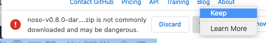
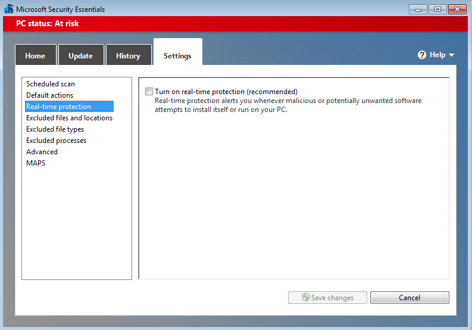
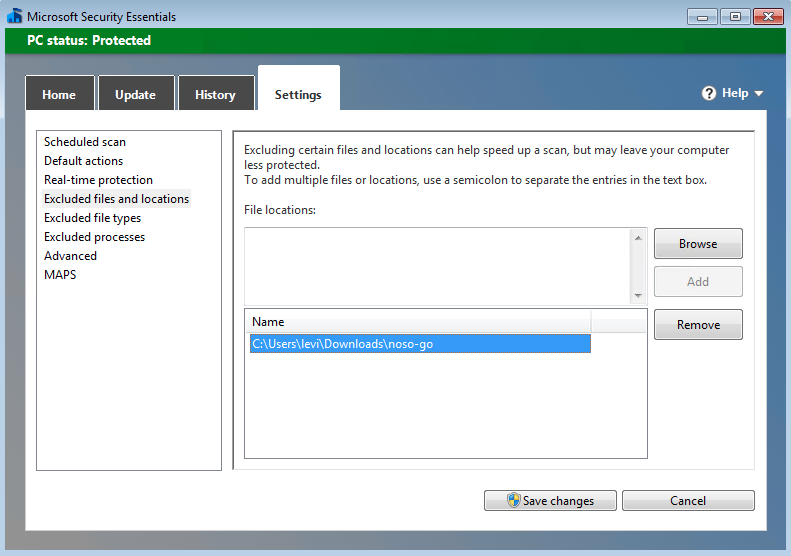
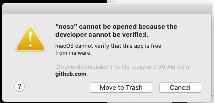
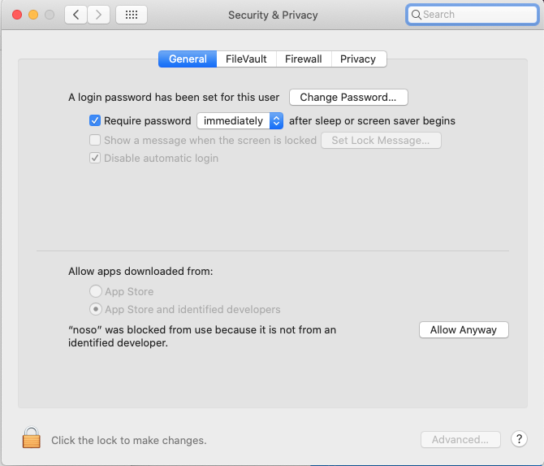

# Noso Coin Miner

## Quickstart

Download the latest release for your OS and architecture from the [Releases Page](https://github.com/leviable/noso-go-releases/releases)

In most instances you will want the `64` version unless you have a fairly old computer

### Quickstart - Windows

1. Unzip the release
2. Edit the `noso-win64.bat` file
3. Update the CPU line with the number of PHYSICAL cores you want to use
4. Update the WALLET line with your wallet address
5. Save and close
6. Double click the noso-win64.bat file 

NOTE: If you have an older 32 bit computer, you will need to use the `noso-win32.bat` version

### Quickstart - Linux/Mac/ARM
Untar the archive:

```
$ tar -zxvf noso-v0.8.0-linux-amd64.tgz
x noso
```

*NOTE* You should set `--cpu` to the maximum *PHYSICAL* cores on your computer. `go-miner` cannot use hyperthreading/hardware-threads, so setting `--cpu` higher than your *PHYSICAL* cores will likely reduce your overall hashrate.

```
./noso mine \
    --address <IP Address or URL of the Noso pool> \
    --password <Password for the Noso pool> \
    --wallet <Your wallet address> \
    --cpu <Number of CPU cores to use when mining>
```

e.g.

```
./noso mine \
    --address noso.dukedog.io \
    --password duke \
    --wallet Nm6jiGfRg7DVHHMfbMJL9CT1DtkUCF \
    --cpu 4          
```

### Quickstart - Android
TODO: update this

## Introduction
`noso-go` is a command line tool for mining the crypto currency [Noso Coin](https://nosocoin.com/). Written using Google's Go language, `noso-go`'s goals are as follows:

* Free to use
* Highly concurrent
* Well optimized
* Cross platform
* Easy to use

`noso-go` is currently confirmed to run on the following platforms

* Windows (32 and 64 bit)
* Linux (32 and 64 bit)
* MacOs (64 bit)
* Raspberry Pi (arm64)
* Google Pixel 5 (arm64)

## Understanding the output

Future version of `noso-go` will have a more user friendly output. For now, you should only need to pay attention to the PING and PONG lines:

```
-> PING 4954
```

* Your Miner's Hash Rate: 4,954 KiloHashes/second, or ~5 MH/s

```
<- PONG PoolData 5351 5AFADEC0006675E408E5C06AA09C0120 10 6 99 953841173 -5 336517
```

* Block: 5351
* Current Step: 6
* Difficulty: 99
* Balance: 9.53841173 Noso
* Blocks Till Payment: 5
* Pool HashRate: 336.517 MegaHashes/second

## Benchmarking

Coming soon

## Chrome/Windows/MacOS Warnings

When downloading the release, you will probably get a warning from your browser, operating system and/or anti-virus software that the release is unsafe. This is because, as of this writing, this project is unable to sign the binaries with trusted certificates, so your browser/OS/AV immediately detects it as an unsigned binary and flags it as a potential threat. You have a couple options to overcome this:

1. First and foremost: inspect the code yourself and make sure you are comfortable with it
1. Build the binary yourself, and your OS wont complain about it. See the [Building](#Building) section below for more info
1. Instruct your browser/OS/AV that you accept the risks
	2. Chrome:
		3. Click the ^ next to `Discard` and select `Keep` 
	2. Windows MSE
		3. (Not recommended) Turn off real-time protection: 
		3. (Recommended) Create an exclusion zone for noso-go releases, and download them to that location: 
	2. MacOS
		3. The first time your run the binary you will get a popup like so. Click `Cancel`: 
		3. Open your `System Preferences` app and click on the `Security & Privacy` icon
		3. There should be a warning on the bottom about the `noso` application being blocked. Click the `Allow Anyway` button: 
	2. Linux
		3. So far I have seen no reports of any flavor of Linux complaining about the binaries. If you come across a problem, please open an [Issue](https://github.com/leviable/noso-go/issues) in this repo and I will add it to the README

## Building

### Prerequisites

* The [Go Compiler](https://golang.org/dl/) (I am using go1.16.3, however most older versions should work fine)

### Steps

1. Download the source code or clone this repo
1. Determine your target OS and Architecture
	2. OS options are: `windows`, `linux` or `darwin`
	2. Architecture options are: `386`, `amd64`, `arm`, or `arm64`
1. Compile (various examples below):
	2. ```$ GOOS=windows GOARCH=amd64 go build -o noso main.go```
	3. ```$ GOOS=darwin GOARCH=amd64 go build -o noso main.go```
	4. ```$ GOOS=linux GOARCH=amd64 go build -o noso main.go```
	5. ```$ GOOS=linux GOARCH=arm64 go build -o noso main.go```